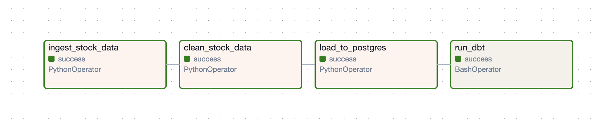
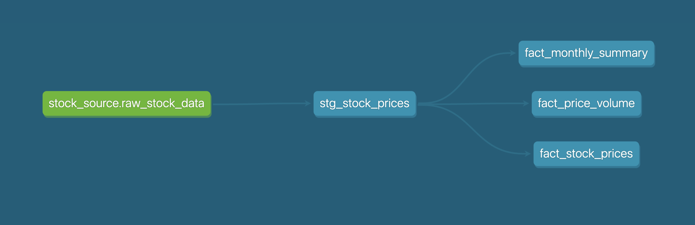

# Stock Data Pipeline

This project is an end-to-end, reproducible data pipeline for collecting, cleaning, storing, transforming, and analyzing daily stock price data. It leverages Python scripts, Apache Airflow for orchestration, dbt for analytics engineering, and PostgreSQL as the data warehouse. The pipeline is modular, extensible, and designed for both learning and production use cases.

## What Does This Project Do?

- **Automates the full lifecycle of stock data analytics:**
  - Fetches daily historical stock prices for the top 10 US tickers from Yahoo Finance.
  - Cleans and standardizes the data for consistency and reliability.
  - Loads the cleaned data into a PostgreSQL database for centralized storage.
  - Uses dbt to transform raw data into analytics-ready tables, including moving averages, volatility, and monthly summaries.
  - Orchestrates the entire process with Airflow, enabling scheduled, hands-off operation.

- **Promotes best practices:**
  - Modular code and clear separation of concerns.
  - Environment variable management for credentials.
  - Automated testing and data quality checks with dbt.
  - Easily extensible to more tickers, new data sources, or additional analytics.

## Project Overview

- **Data Ingestion:** Downloads daily stock data for top 10 tickers using Yahoo Finance.
- **Data Cleaning:** Cleans and standardizes the raw data.
- **Data Loading:** Loads cleaned data into a PostgreSQL table.
- **Transformation & Analytics:** Uses dbt to create marts and analytics tables (moving averages, volatility, monthly summaries, etc).
- **Orchestration:** Airflow DAG automates the entire workflow.

## Architecture



## Data Lineage



## File Structure

```
stock-data-pipeline/
├── airflow/
│   ├── dags/
│   │   └── stock_pipeline_dag.py
│   ├── airflow.cfg
│   └── ...
├── cleaned_data/
│   └── *_daily_cleaned.csv
├── dbt_stock_pipeline/
│   ├── dbt_project.yml
│   ├── models/
│   │   ├── marts/
│   │   │   ├── fact_monthly_summary.sql
│   │   │   ├── fact_price_volume.sql
│   │   │   └── fact_stock_prices.sql
│   │   └── staging/
│   │       └── stg_stock_prices.sql
│   └── models/schema.yml
├── imgs/
│   ├── dag_flow.png
│   └── data_lineage.png
├── raw_data/
│   └── *_daily.csv
├── ingest_stock_data.py
├── clean_stock_data.py
├── load_to_postgres.py
├── requirements.txt
└── ...
```

## Setup Instructions

### 1. Clone the Repository
```bash
git clone <your-repo-url>
cd stock-data-pipeline
```

### 2. Set Up Python Environment
```bash
python3 -m venv venv
source venv/bin/activate
pip install -r requirements.txt
```

### 3. Configure Environment Variables
Copy `.env.example` to `.env` and fill in your PostgreSQL credentials:
```bash
cp .env.example .env
```

### 4. Initialize the Database
Ensure PostgreSQL is running and accessible with the credentials in your `.env` file.

### 5. Run the Pipeline Manually (Optional)
You can run each step manually for testing:
```bash
python ingest_stock_data.py
python clean_stock_data.py
python load_to_postgres.py
```

### 6. Set Up Airflow
```bash
export AIRFLOW_HOME=$(pwd)/airflow
pip install apache-airflow
# Initialize Airflow DB
airflow db init
# Create a user (follow prompts)
airflow users create --username admin --password admin --firstname Admin --lastname User --role Admin --email admin@example.com
# Start webserver and scheduler
airflow webserver -p 8080 &
airflow scheduler &
```

- Access Airflow UI at [http://localhost:8080](http://localhost:8080)
- Enable the `stock_pipeline` DAG.

### 7. Set Up and Run dbt
```bash
cd dbt_stock_pipeline
# Edit dbt_project.yml and profiles.yml if needed
# Run dbt models
source ../venv/bin/activate
dbt run
# Run dbt tests
 dbt test
```

## How the Pipeline Works

1. **Ingestion:** Downloads daily stock data for each ticker to `raw_data/`.
2. **Cleaning:** Cleans and standardizes the data, saving to `cleaned_data/`.
3. **Loading:** Loads cleaned data into the `raw_stock_data` table in PostgreSQL.
4. **Transformation:** dbt models transform and aggregate the data for analytics.
5. **Orchestration:** Airflow DAG automates the above steps daily.

## Customization
- To add more tickers, edit the `TICKERS` list in the Python scripts.
- To change the database, update `.env` and `dbt_stock_pipeline/profiles.yml`.
